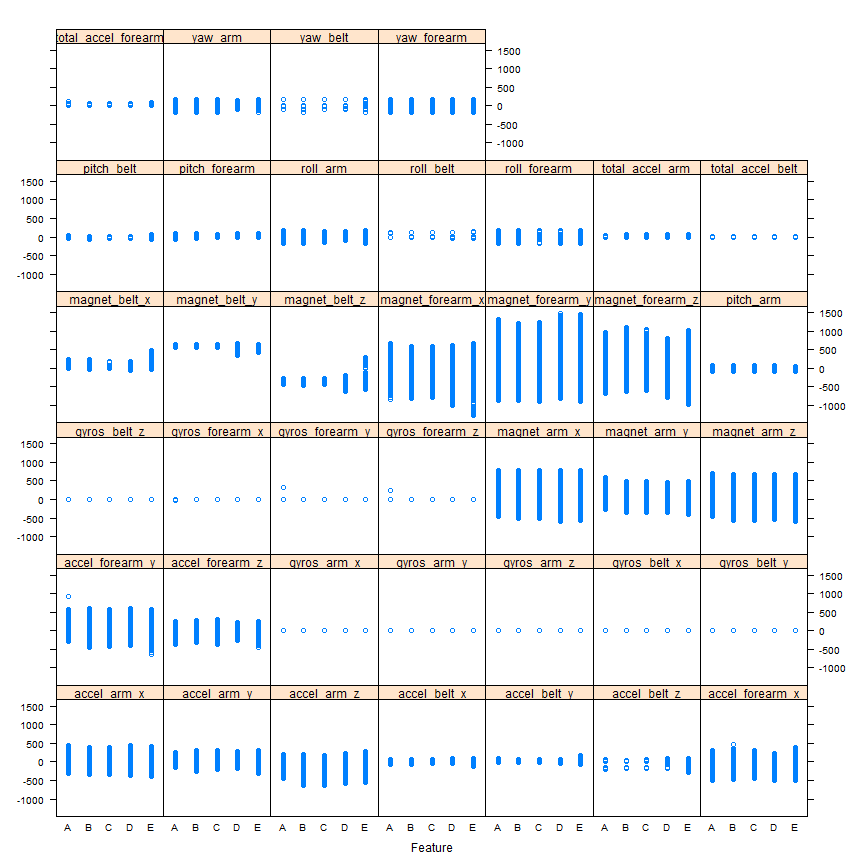
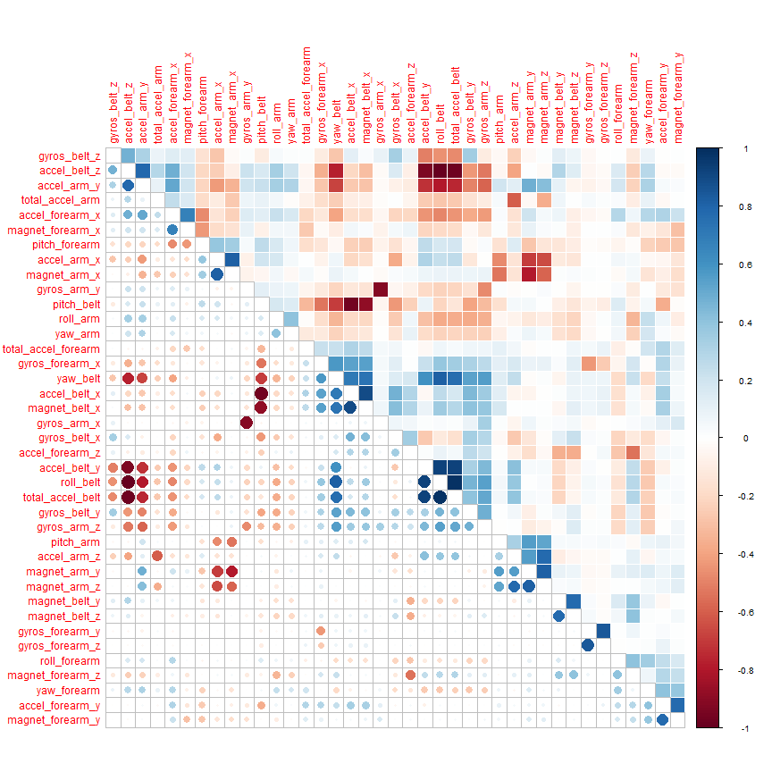
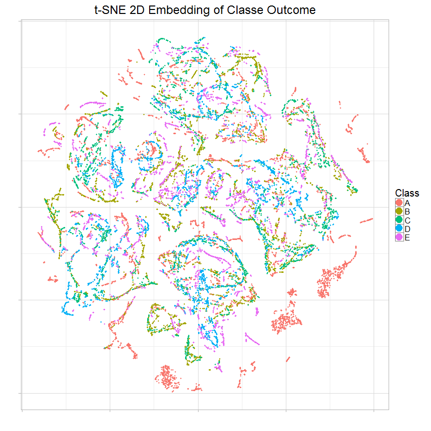
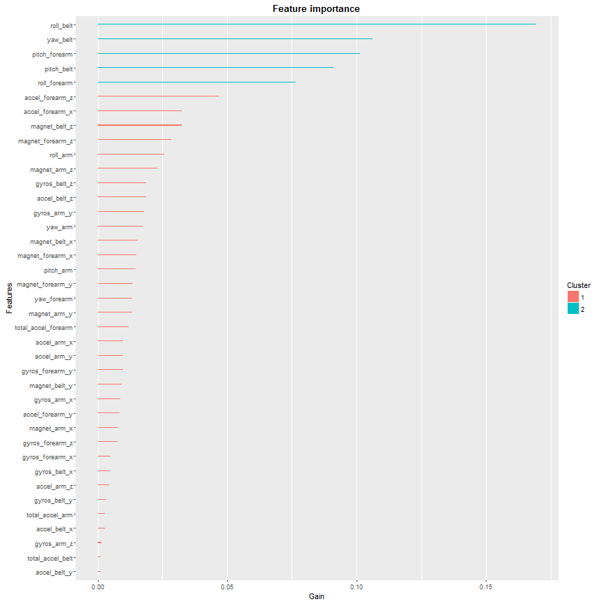

# Machine Learning - Prediction Assignment Writeup
cstanca1  
January 31, 2016  


#Introduction
This report incorporates the results of the analysis performed to predict the manner in which 6 participants perform barbell lifts. They were asked to perform barbell lifts correctly and incorrectly in 5 different ways. More information is available from the website: http://groupware.les.inf.puc-rio.br/har (see the section on the Weight Lifting Exercise Dataset).

# Required Packages

```r
require(caret)
```

```
## Loading required package: caret
```

```
## Warning: package 'caret' was built under R version 3.2.3
```

```
## Loading required package: lattice
```

```
## Loading required package: ggplot2
```

```
## Warning: package 'ggplot2' was built under R version 3.2.3
```

```r
require(corrplot)
```

```
## Loading required package: corrplot
```

```
## Warning: package 'corrplot' was built under R version 3.2.3
```

```r
require(Rtsne)
```

```
## Loading required package: Rtsne
```

```
## Warning: package 'Rtsne' was built under R version 3.2.3
```

```r
require(xgboost)
```

```
## Loading required package: xgboost
```

```
## Warning: package 'xgboost' was built under R version 3.2.3
```

```r
require(stats)
require(knitr)
```

```
## Loading required package: knitr
```

```
## Warning: package 'knitr' was built under R version 3.2.3
```

```r
require(ggplot2)
require(Ckmeans.1d.dp)
```

```
## Loading required package: Ckmeans.1d.dp
```

```
## Warning: package 'Ckmeans.1d.dp' was built under R version 3.2.3
```

```r
knitr::opts_chunk$set(cache=TRUE)
```

# Data

```r
# training and testing data:
training.url ="https://d396qusza40orc.cloudfront.net/predmachlearn/pml-training.csv"
testing.url = "https://d396qusza40orc.cloudfront.net/predmachlearn/pml-testing.csv"

# set file names
training.filename = "./data/pml-training.csv"
testing.filename = "./data/pml-testing.csv"

# create directory, if one does not exist
if (!file.exists("./data")) {
  dir.create("./data")
}

# download files, if they don't exist already
if (!file.exists(training.filename)) {
  download.file(training.url, destfile=training.filename, method="curl")
}
if (!file.exists(testing.filename)) {
  download.file(testing.url, destfile=testing.filename, method="curl")
}

# define training and testing dataframes
training = read.csv(training.filename)
testing = read.csv(testing.filename)

# set training and testing dataframes dimensions
dim(training)
```

```
## [1] 19622   160
```

```r
dim(testing)
```

```
## [1]  20 160
```

```r
# collect training and testing column names
names(training)
```

```
##   [1] "X"                        "user_name"               
##   [3] "raw_timestamp_part_1"     "raw_timestamp_part_2"    
##   [5] "cvtd_timestamp"           "new_window"              
##   [7] "num_window"               "roll_belt"               
##   [9] "pitch_belt"               "yaw_belt"                
##  [11] "total_accel_belt"         "kurtosis_roll_belt"      
##  [13] "kurtosis_picth_belt"      "kurtosis_yaw_belt"       
##  [15] "skewness_roll_belt"       "skewness_roll_belt.1"    
##  [17] "skewness_yaw_belt"        "max_roll_belt"           
##  [19] "max_picth_belt"           "max_yaw_belt"            
##  [21] "min_roll_belt"            "min_pitch_belt"          
##  [23] "min_yaw_belt"             "amplitude_roll_belt"     
##  [25] "amplitude_pitch_belt"     "amplitude_yaw_belt"      
##  [27] "var_total_accel_belt"     "avg_roll_belt"           
##  [29] "stddev_roll_belt"         "var_roll_belt"           
##  [31] "avg_pitch_belt"           "stddev_pitch_belt"       
##  [33] "var_pitch_belt"           "avg_yaw_belt"            
##  [35] "stddev_yaw_belt"          "var_yaw_belt"            
##  [37] "gyros_belt_x"             "gyros_belt_y"            
##  [39] "gyros_belt_z"             "accel_belt_x"            
##  [41] "accel_belt_y"             "accel_belt_z"            
##  [43] "magnet_belt_x"            "magnet_belt_y"           
##  [45] "magnet_belt_z"            "roll_arm"                
##  [47] "pitch_arm"                "yaw_arm"                 
##  [49] "total_accel_arm"          "var_accel_arm"           
##  [51] "avg_roll_arm"             "stddev_roll_arm"         
##  [53] "var_roll_arm"             "avg_pitch_arm"           
##  [55] "stddev_pitch_arm"         "var_pitch_arm"           
##  [57] "avg_yaw_arm"              "stddev_yaw_arm"          
##  [59] "var_yaw_arm"              "gyros_arm_x"             
##  [61] "gyros_arm_y"              "gyros_arm_z"             
##  [63] "accel_arm_x"              "accel_arm_y"             
##  [65] "accel_arm_z"              "magnet_arm_x"            
##  [67] "magnet_arm_y"             "magnet_arm_z"            
##  [69] "kurtosis_roll_arm"        "kurtosis_picth_arm"      
##  [71] "kurtosis_yaw_arm"         "skewness_roll_arm"       
##  [73] "skewness_pitch_arm"       "skewness_yaw_arm"        
##  [75] "max_roll_arm"             "max_picth_arm"           
##  [77] "max_yaw_arm"              "min_roll_arm"            
##  [79] "min_pitch_arm"            "min_yaw_arm"             
##  [81] "amplitude_roll_arm"       "amplitude_pitch_arm"     
##  [83] "amplitude_yaw_arm"        "roll_dumbbell"           
##  [85] "pitch_dumbbell"           "yaw_dumbbell"            
##  [87] "kurtosis_roll_dumbbell"   "kurtosis_picth_dumbbell" 
##  [89] "kurtosis_yaw_dumbbell"    "skewness_roll_dumbbell"  
##  [91] "skewness_pitch_dumbbell"  "skewness_yaw_dumbbell"   
##  [93] "max_roll_dumbbell"        "max_picth_dumbbell"      
##  [95] "max_yaw_dumbbell"         "min_roll_dumbbell"       
##  [97] "min_pitch_dumbbell"       "min_yaw_dumbbell"        
##  [99] "amplitude_roll_dumbbell"  "amplitude_pitch_dumbbell"
## [101] "amplitude_yaw_dumbbell"   "total_accel_dumbbell"    
## [103] "var_accel_dumbbell"       "avg_roll_dumbbell"       
## [105] "stddev_roll_dumbbell"     "var_roll_dumbbell"       
## [107] "avg_pitch_dumbbell"       "stddev_pitch_dumbbell"   
## [109] "var_pitch_dumbbell"       "avg_yaw_dumbbell"        
## [111] "stddev_yaw_dumbbell"      "var_yaw_dumbbell"        
## [113] "gyros_dumbbell_x"         "gyros_dumbbell_y"        
## [115] "gyros_dumbbell_z"         "accel_dumbbell_x"        
## [117] "accel_dumbbell_y"         "accel_dumbbell_z"        
## [119] "magnet_dumbbell_x"        "magnet_dumbbell_y"       
## [121] "magnet_dumbbell_z"        "roll_forearm"            
## [123] "pitch_forearm"            "yaw_forearm"             
## [125] "kurtosis_roll_forearm"    "kurtosis_picth_forearm"  
## [127] "kurtosis_yaw_forearm"     "skewness_roll_forearm"   
## [129] "skewness_pitch_forearm"   "skewness_yaw_forearm"    
## [131] "max_roll_forearm"         "max_picth_forearm"       
## [133] "max_yaw_forearm"          "min_roll_forearm"        
## [135] "min_pitch_forearm"        "min_yaw_forearm"         
## [137] "amplitude_roll_forearm"   "amplitude_pitch_forearm" 
## [139] "amplitude_yaw_forearm"    "total_accel_forearm"     
## [141] "var_accel_forearm"        "avg_roll_forearm"        
## [143] "stddev_roll_forearm"      "var_roll_forearm"        
## [145] "avg_pitch_forearm"        "stddev_pitch_forearm"    
## [147] "var_pitch_forearm"        "avg_yaw_forearm"         
## [149] "stddev_yaw_forearm"       "var_yaw_forearm"         
## [151] "gyros_forearm_x"          "gyros_forearm_y"         
## [153] "gyros_forearm_z"          "accel_forearm_x"         
## [155] "accel_forearm_y"          "accel_forearm_z"         
## [157] "magnet_forearm_x"         "magnet_forearm_y"        
## [159] "magnet_forearm_z"         "classe"
```

```r
names(testing)
```

```
##   [1] "X"                        "user_name"               
##   [3] "raw_timestamp_part_1"     "raw_timestamp_part_2"    
##   [5] "cvtd_timestamp"           "new_window"              
##   [7] "num_window"               "roll_belt"               
##   [9] "pitch_belt"               "yaw_belt"                
##  [11] "total_accel_belt"         "kurtosis_roll_belt"      
##  [13] "kurtosis_picth_belt"      "kurtosis_yaw_belt"       
##  [15] "skewness_roll_belt"       "skewness_roll_belt.1"    
##  [17] "skewness_yaw_belt"        "max_roll_belt"           
##  [19] "max_picth_belt"           "max_yaw_belt"            
##  [21] "min_roll_belt"            "min_pitch_belt"          
##  [23] "min_yaw_belt"             "amplitude_roll_belt"     
##  [25] "amplitude_pitch_belt"     "amplitude_yaw_belt"      
##  [27] "var_total_accel_belt"     "avg_roll_belt"           
##  [29] "stddev_roll_belt"         "var_roll_belt"           
##  [31] "avg_pitch_belt"           "stddev_pitch_belt"       
##  [33] "var_pitch_belt"           "avg_yaw_belt"            
##  [35] "stddev_yaw_belt"          "var_yaw_belt"            
##  [37] "gyros_belt_x"             "gyros_belt_y"            
##  [39] "gyros_belt_z"             "accel_belt_x"            
##  [41] "accel_belt_y"             "accel_belt_z"            
##  [43] "magnet_belt_x"            "magnet_belt_y"           
##  [45] "magnet_belt_z"            "roll_arm"                
##  [47] "pitch_arm"                "yaw_arm"                 
##  [49] "total_accel_arm"          "var_accel_arm"           
##  [51] "avg_roll_arm"             "stddev_roll_arm"         
##  [53] "var_roll_arm"             "avg_pitch_arm"           
##  [55] "stddev_pitch_arm"         "var_pitch_arm"           
##  [57] "avg_yaw_arm"              "stddev_yaw_arm"          
##  [59] "var_yaw_arm"              "gyros_arm_x"             
##  [61] "gyros_arm_y"              "gyros_arm_z"             
##  [63] "accel_arm_x"              "accel_arm_y"             
##  [65] "accel_arm_z"              "magnet_arm_x"            
##  [67] "magnet_arm_y"             "magnet_arm_z"            
##  [69] "kurtosis_roll_arm"        "kurtosis_picth_arm"      
##  [71] "kurtosis_yaw_arm"         "skewness_roll_arm"       
##  [73] "skewness_pitch_arm"       "skewness_yaw_arm"        
##  [75] "max_roll_arm"             "max_picth_arm"           
##  [77] "max_yaw_arm"              "min_roll_arm"            
##  [79] "min_pitch_arm"            "min_yaw_arm"             
##  [81] "amplitude_roll_arm"       "amplitude_pitch_arm"     
##  [83] "amplitude_yaw_arm"        "roll_dumbbell"           
##  [85] "pitch_dumbbell"           "yaw_dumbbell"            
##  [87] "kurtosis_roll_dumbbell"   "kurtosis_picth_dumbbell" 
##  [89] "kurtosis_yaw_dumbbell"    "skewness_roll_dumbbell"  
##  [91] "skewness_pitch_dumbbell"  "skewness_yaw_dumbbell"   
##  [93] "max_roll_dumbbell"        "max_picth_dumbbell"      
##  [95] "max_yaw_dumbbell"         "min_roll_dumbbell"       
##  [97] "min_pitch_dumbbell"       "min_yaw_dumbbell"        
##  [99] "amplitude_roll_dumbbell"  "amplitude_pitch_dumbbell"
## [101] "amplitude_yaw_dumbbell"   "total_accel_dumbbell"    
## [103] "var_accel_dumbbell"       "avg_roll_dumbbell"       
## [105] "stddev_roll_dumbbell"     "var_roll_dumbbell"       
## [107] "avg_pitch_dumbbell"       "stddev_pitch_dumbbell"   
## [109] "var_pitch_dumbbell"       "avg_yaw_dumbbell"        
## [111] "stddev_yaw_dumbbell"      "var_yaw_dumbbell"        
## [113] "gyros_dumbbell_x"         "gyros_dumbbell_y"        
## [115] "gyros_dumbbell_z"         "accel_dumbbell_x"        
## [117] "accel_dumbbell_y"         "accel_dumbbell_z"        
## [119] "magnet_dumbbell_x"        "magnet_dumbbell_y"       
## [121] "magnet_dumbbell_z"        "roll_forearm"            
## [123] "pitch_forearm"            "yaw_forearm"             
## [125] "kurtosis_roll_forearm"    "kurtosis_picth_forearm"  
## [127] "kurtosis_yaw_forearm"     "skewness_roll_forearm"   
## [129] "skewness_pitch_forearm"   "skewness_yaw_forearm"    
## [131] "max_roll_forearm"         "max_picth_forearm"       
## [133] "max_yaw_forearm"          "min_roll_forearm"        
## [135] "min_pitch_forearm"        "min_yaw_forearm"         
## [137] "amplitude_roll_forearm"   "amplitude_pitch_forearm" 
## [139] "amplitude_yaw_forearm"    "total_accel_forearm"     
## [141] "var_accel_forearm"        "avg_roll_forearm"        
## [143] "stddev_roll_forearm"      "var_roll_forearm"        
## [145] "avg_pitch_forearm"        "stddev_pitch_forearm"    
## [147] "var_pitch_forearm"        "avg_yaw_forearm"         
## [149] "stddev_yaw_forearm"       "var_yaw_forearm"         
## [151] "gyros_forearm_x"          "gyros_forearm_y"         
## [153] "gyros_forearm_z"          "accel_forearm_x"         
## [155] "accel_forearm_y"          "accel_forearm_z"         
## [157] "magnet_forearm_x"         "magnet_forearm_y"        
## [159] "magnet_forearm_z"         "problem_id"
```

The raw training data has 19622 rows of observations and 160 features (predictors). 
Column `X` is an unusable row number. 
The raw testing data has 20 rows and 39 features. 
There is one column of target outcome named `classe`.   

## Data Pre-Processing
Keep only the predictors ("activity monitors").
Extract target outcome from training data ("activity quality").


```r
# target outcome
outcome.o = training[, "classe"]
outcome = outcome.o
levels(outcome)
```

```
## [1] "A" "B" "C" "D" "E"
```
Outcome has 5 levels in character format, "A", "B" ... 
XGBoost gradient booster only recognizes numeric data. 
Thus, it needs to be converted to numeric, 1, 2, ... 


```r
# convert character levels to numeric
num.class = length(levels(outcome))
levels(outcome) = 1:num.class
head(outcome)
```

```
## [1] 1 1 1 1 1 1
## Levels: 1 2 3 4 5
```

Remove outcome from training data.   

```r
# remove outcome from training
training$classe = NULL
```

Per assignment, only `belt`, `forearm`, `arm`, and `dumbell` features are needed.

```r
# filter columns on belt, forearm, arm, dumbell
filter = grepl("belt|forearm|arm|dumbell", names(training))
training = training[, filter]
testing = testing[, filter]
```

Remove all columns with NA values.   

```r
# remove columns with NA, use test data as referal for NA
cols.without.na = colSums(is.na(testing)) == 0
training = training[, cols.without.na]
testing = testing[, cols.without.na]
```

# Pre-Processing  
## Features Variance
Per PCA, features must have maximum variance for maximum uniqueness; each feature is as distant as possible from the other features.   

```r
# zero variance
zero.var = nearZeroVar(training, saveMetrics=TRUE)
zero.var
```

```
##                     freqRatio percentUnique zeroVar   nzv
## roll_belt            1.101904     6.7781062   FALSE FALSE
## pitch_belt           1.036082     9.3772296   FALSE FALSE
## yaw_belt             1.058480     9.9734991   FALSE FALSE
## total_accel_belt     1.063160     0.1477933   FALSE FALSE
## gyros_belt_x         1.058651     0.7134849   FALSE FALSE
## gyros_belt_y         1.144000     0.3516461   FALSE FALSE
## gyros_belt_z         1.066214     0.8612782   FALSE FALSE
## accel_belt_x         1.055412     0.8357966   FALSE FALSE
## accel_belt_y         1.113725     0.7287738   FALSE FALSE
## accel_belt_z         1.078767     1.5237998   FALSE FALSE
## magnet_belt_x        1.090141     1.6664968   FALSE FALSE
## magnet_belt_y        1.099688     1.5187035   FALSE FALSE
## magnet_belt_z        1.006369     2.3290184   FALSE FALSE
## roll_arm            52.338462    13.5256345   FALSE FALSE
## pitch_arm           87.256410    15.7323412   FALSE FALSE
## yaw_arm             33.029126    14.6570176   FALSE FALSE
## total_accel_arm      1.024526     0.3363572   FALSE FALSE
## gyros_arm_x          1.015504     3.2769341   FALSE FALSE
## gyros_arm_y          1.454369     1.9162165   FALSE FALSE
## gyros_arm_z          1.110687     1.2638875   FALSE FALSE
## accel_arm_x          1.017341     3.9598410   FALSE FALSE
## accel_arm_y          1.140187     2.7367241   FALSE FALSE
## accel_arm_z          1.128000     4.0362858   FALSE FALSE
## magnet_arm_x         1.000000     6.8239731   FALSE FALSE
## magnet_arm_y         1.056818     4.4439914   FALSE FALSE
## magnet_arm_z         1.036364     6.4468454   FALSE FALSE
## roll_forearm        11.589286    11.0895933   FALSE FALSE
## pitch_forearm       65.983051    14.8557741   FALSE FALSE
## yaw_forearm         15.322835    10.1467740   FALSE FALSE
## total_accel_forearm  1.128928     0.3567424   FALSE FALSE
## gyros_forearm_x      1.059273     1.5187035   FALSE FALSE
## gyros_forearm_y      1.036554     3.7763735   FALSE FALSE
## gyros_forearm_z      1.122917     1.5645704   FALSE FALSE
## accel_forearm_x      1.126437     4.0464784   FALSE FALSE
## accel_forearm_y      1.059406     5.1116094   FALSE FALSE
## accel_forearm_z      1.006250     2.9558659   FALSE FALSE
## magnet_forearm_x     1.012346     7.7667924   FALSE FALSE
## magnet_forearm_y     1.246914     9.5403119   FALSE FALSE
## magnet_forearm_z     1.000000     8.5771073   FALSE FALSE
```

All features have variability. No feature will be removed.  

## Features-Outcome Relationship
Features have approximately the same distribution among the 5 outcome levels.   

```r
featurePlot(training, outcome.o, "strip")
```

<!-- -->

## Features Correlation Matrix  
As per plot below, features seem to be good enough because they seem reasonably uncorrelated (orthogonal) each others. The average of correlation is not too high, so I decided to not perform any further PCA pre-processing.    

```r
corrplot.mixed(cor(training), lower="circle", upper="color", tl.pos="lt", diag="n", order="hclust", hclust.method="complete")
```

<!-- -->

## tSNE Visualization  
The tSNE (t-Distributed Stochastic Neighbor Embedding) plot below does not show a clear clustering separation of the 5 levels of outcome. So manually building of any regression equation from the irregularity does not seem needed.

```r
# t-Distributed Stochastic Neighbor Embedding
tsne = Rtsne(as.matrix(training), check_duplicates=FALSE, pca=TRUE, perplexity=30, theta=0.5, dims=2)
embedding = as.data.frame(tsne$Y)
embedding$Class = outcome.o
g = ggplot(embedding, aes(x=V1, y=V2, color=Class)) +
  geom_point(size=1.25) +
  guides(colour=guide_legend(override.aes=list(size=6))) +
  xlab("") + ylab("") +
  ggtitle("t-SNE 2D Embedding of Classe Outcome") +
  theme_light(base_size=20) +
  theme(axis.text.x=element_blank(),
        axis.text.y=element_blank())
print(g)
```

<!-- -->

# Machine Learning Model 
The model is built to predict activity quality (`classe` outcome) from the activity monitors (predictors).


```r
# convert training, testing and outcome to matrix and numeric, as required by XGBoost
training.matrix = as.matrix(training)
mode(training.matrix) = "numeric"
testing.matrix = as.matrix(testing)
mode(testing.matrix) = "numeric"
# convert outcome from factor to numeric matrix 
#   xgboost takes multi-labels in [0, numOfClass)
y = as.matrix(as.integer(outcome)-1)
```

## XGBoost Parameters 
Set XGBoost parameters for cross validation and training, multiclass classification and evaluation metric.


```r
# xgboost parameters
param <- list("objective" = "multi:softprob",   # multiclass classification 
"num_class" = num.class,                        # number of classes 
"eval_metric" = "merror",                       # evaluation metric 
"nthread" = 8,                                  # number of threads to be used 
"max_depth" = 16,                               # max. depth of tree 
"eta" = 0.3,                                    # step size shrinkage 
"gamma" = 0,                                    # min. loss reduction 
"subsample" = 1,                                # part of data instances to grow tree 
"colsample_bytree" = 1,                         # subsample ratio of columns, by tree
"min_child_weight" = 12                         # min. sum of instance weight in a child 
)
```

## Error Rate 
Perform cross-validation to estimate the error rate using 4-fold cross validation, with 200 epochs to reach the expected error rate of less than `1%`.  

## Cross-Validation  

```r
# set random seed, for reproducibility 
set.seed(1234)
# k-fold cross validation with timing
nround.cv = 200
system.time( bst.cv <- xgb.cv(param=param, data=training.matrix, label=y, nfold=4, nrounds=nround.cv, prediction=TRUE, verbose=FALSE) )
```

```
##    user  system elapsed 
##  879.49   40.68  252.64
```

```r
tail(bst.cv$dt) 
```

```
##    train.merror.mean train.merror.std test.merror.mean test.merror.std
## 1:                 0                0         0.005504        0.001165
## 2:                 0                0         0.005555        0.001071
## 3:                 0                0         0.005555        0.001071
## 4:                 0                0         0.005555        0.001071
## 5:                 0                0         0.005606        0.001135
## 6:                 0                0         0.005555        0.001109
```
From the cross-validation, choose the index with the minimum multiclass error rate, index to be used in the model training to meet the expected minimum error rate of `< 1%`.  


```r
# minimum merror index
min.merror.idx = which.min(bst.cv$dt[, test.merror.mean]) 
min.merror.idx 
```

```
## [1] 187
```

```r
# minimum merror
bst.cv$dt[min.merror.idx,]
```

```
##    train.merror.mean train.merror.std test.merror.mean test.merror.std
## 1:                 0                0         0.005402        0.000978
```
The results indicate that the best minimum error rate `testing.merror.mean` is about 0.005 (0.5%).

## Confusion Matrix 
Tabulates the cross-validation's predictions of the model against the truths.  


```r
# get cross-validation prediction decoding
pred.cv = matrix(bst.cv$pred, nrow=length(bst.cv$pred)/num.class, ncol=num.class)
pred.cv = max.col(pred.cv, "last")
# confusion matrix
confusionMatrix(factor(y+1), factor(pred.cv))
```

```
## Confusion Matrix and Statistics
## 
##           Reference
## Prediction    1    2    3    4    5
##          1 5566   10    2    2    0
##          2   12 3772   12    0    1
##          3    0   24 3384   14    0
##          4    0    0   19 3194    3
##          5    0    1    1    8 3597
## 
## Overall Statistics
##                                           
##                Accuracy : 0.9944          
##                  95% CI : (0.9933, 0.9954)
##     No Information Rate : 0.2843          
##     P-Value [Acc > NIR] : < 2.2e-16       
##                                           
##                   Kappa : 0.993           
##  Mcnemar's Test P-Value : NA              
## 
## Statistics by Class:
## 
##                      Class: 1 Class: 2 Class: 3 Class: 4 Class: 5
## Sensitivity            0.9978   0.9908   0.9901   0.9925   0.9989
## Specificity            0.9990   0.9984   0.9977   0.9987   0.9994
## Pos Pred Value         0.9975   0.9934   0.9889   0.9932   0.9972
## Neg Pred Value         0.9991   0.9978   0.9979   0.9985   0.9998
## Prevalence             0.2843   0.1940   0.1742   0.1640   0.1835
## Detection Rate         0.2837   0.1922   0.1725   0.1628   0.1833
## Detection Prevalence   0.2844   0.1935   0.1744   0.1639   0.1838
## Balanced Accuracy      0.9984   0.9946   0.9939   0.9956   0.9991
```

The confusion matrix shows concentration of correct predictions on the diagonal. 
The average accuracy is more than `99%`, with an error rate less than `1%`, both fulfilling the requirements.  

## Model Training 
Fit the XGBoost gradient boosting model on the training data.   

```r
# real model fit training, with full data
system.time( bst <- xgboost(param=param, data=training.matrix, label=y, nrounds=min.merror.idx, verbose=0) )
```

```
##    user  system elapsed 
##  270.86   10.33   75.28
```

## Predicting Testing Data

```r
# xgboost predict test data using the trained model
pred <- predict(bst, testing.matrix)  
head(pred, 10)  
```

```
##  [1] 2.722199e-04 9.982042e-01 1.132105e-03 1.515472e-04 2.398420e-04
##  [6] 9.991074e-01 6.353945e-04 2.402208e-04 3.893657e-06 1.299460e-05
```

## Post-Processing
The output is the predicted probability of the 5 levels of outcome.  


```r
# decode prediction to qualitative letters (A, B, C, D, E).
pred = matrix(pred, nrow=num.class, ncol=length(pred)/num.class)
pred = t(pred)
pred = max.col(pred, "last")
pred.char = toupper(letters[pred])
pred
```

```
##  [1] 2 1 2 1 1 5 4 2 1 1 2 3 2 1 5 5 1 2 2 2
```

## Feature Importance


```r
# get the trained model
model = xgb.dump(bst, with.stats=TRUE)
# get the feature names
names = dimnames(training.matrix)[[2]]
# compute feature importance matrix
importance_matrix = xgb.importance(names, model=bst)
# plot feature importance
gp = xgb.plot.importance(importance_matrix)
print(gp) 
```

<!-- -->
Feature importance plot is useful to select only best features with highest correlation to the outcome(s).

# Create Submission Files for 20 Test Cases

```r
path = "./test_cases/"
pml_write_files = function(x) {
  n = length(x)
  for(i in 1: n) {
    filename = paste0("test_case_id_", i, ".txt")
    write.table(x[i], file=file.path(path, filename), 
                quote=FALSE, row.names=FALSE, col.names=FALSE)
  }
}
pml_write_files(pred.char)
```
